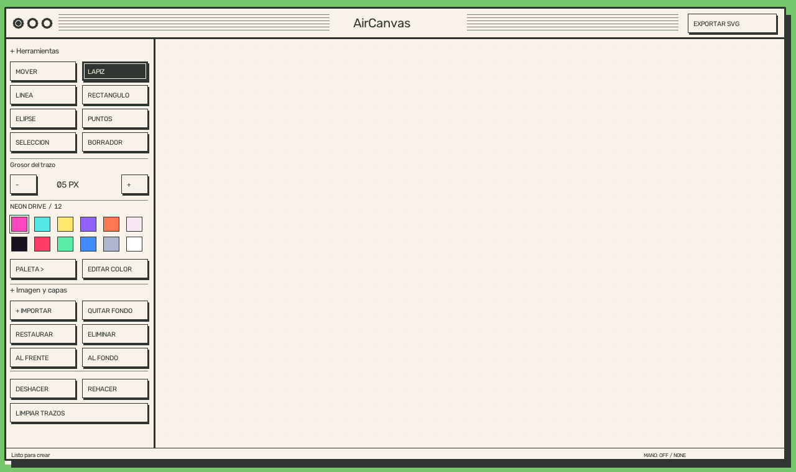

# AirCanvas / Macintosh Studio

Editor de dibujo con interfaz Macintosh clásica: escritorio verde, papel crema,
bordes oscuros y botones monocromáticos. Incluye ratón y gestos opcionales.

## Ejecutar

Instala Python y las dependencias de `requirements.txt`, luego ejecuta `python main.py`.
En el entorno preparado de esta carpeta: `.venv\Scripts\python.exe main.py`.
Ese entorno contiene OpenCV y NumPy; instala MediaPipe para habilitar el seguimiento.
El seguimiento existente requiere una versión de MediaPipe que exponga `mp.solutions.hands`.
Si la cámara o el seguimiento no están disponibles, puedes trabajar con el ratón.

## Controles

- Lápiz, puntos, línea, rectángulo y elipse: pulsa y arrastra; suelta para terminar.
- Borrador: borra los trazos, sin afectar las imágenes importadas.
- Mover o Selección: arrastra una imagen desde cualquier punto. La rueda cambia su tamaño.
- Al frente / Al fondo: ordena las imágenes sobre los trazos.
- Paleta: alterna Neon Drive, Sunset FM y Arcade. Selecciona una muestra y pulsa Editar color.
  Los cambios se guardan automáticamente en `palettes.json`.
- Quitar fondo: elimina colores similares al fondo del borde, conectados con el exterior.
  Funciona mejor con fondos uniformes. Restaurar recupera la imagen original.
- Exportar SVG: guarda el área de trabajo transparente, sin cámara, cuadrícula ni controles.
  Los trazos son vectores; las fotos son PNG incrustados, conservando transparencia y posición.
- Deshacer / Rehacer: historial de trazos. Limpiar trazos pide confirmación y vacía ese historial.

Atajos: B lápiz, V mover, E borrador, Z deshacer, Y rehacer, S exportar,
C limpiar, Supr eliminar imagen, Q o Escape salir.

Gestos: pinza para dibujar/pulsar/arrastrar; dos dedos para escalar la imagen seleccionada
con Mover o Selección; mano abierta para borrar. El ratón tiene prioridad mientras lo mantienes pulsado.

## Comprobación

`python -m unittest test_studio -v`

Las pruebas cubren transparencia, borrado e historial, geometría SVG, imágenes incrustadas,
arrastre, escala y límites del panel. Generan `exports/ui-preview.png` para revisar el diseño.
La cámara y los diálogos nativos requieren una comprobación interactiva.
